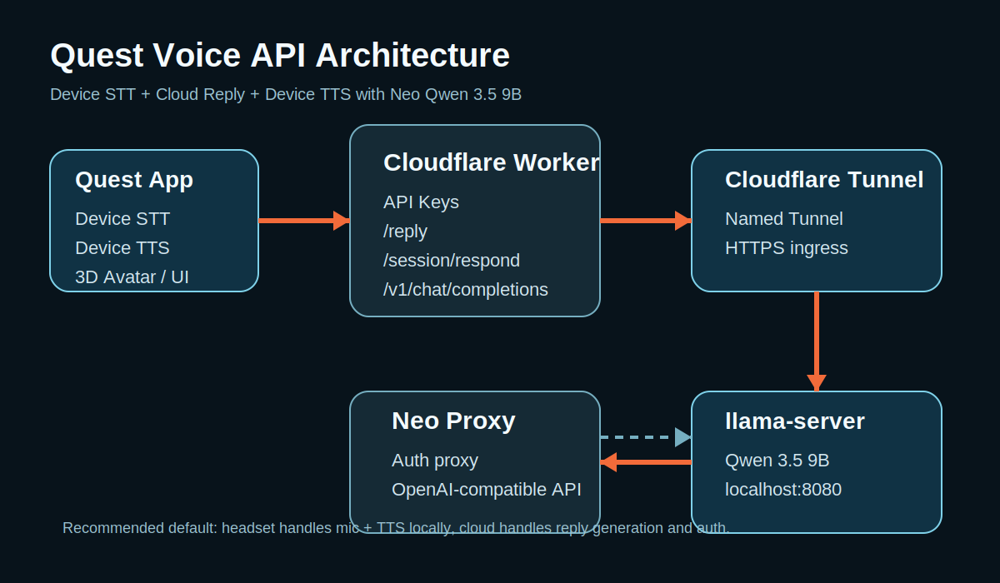

# Quest Voice API

Quest Voice API is a Meta Quest 2 voice-assistant backend and demo app scaffold.

It is designed for teams who already have a Quest app or 3D avatar experience and need:

- device speech-to-text on the headset or Android app
- cloud reply generation
- device text-to-speech on the headset or Android app
- optional cloud STT and cloud TTS
- API-key based remote access for teammates in different cities
- an OpenAI-compatible endpoint for easy client integration

## At a glance

- Meta Quest 2 friendly
- supports `Device STT + Cloud Reply + Device TTS`
- supports OpenAI-compatible chat clients
- Cloudflare Worker public API
- local Qwen 3.5 9B / `llama-server` compatible
- team-shareable with API keys



## Recommended architecture

Default mode:

- `STT = device`
- `Reply = cloud`
- `TTS = device`

This keeps latency low and avoids Android microphone-sharing limitations while still letting the team use the same cloud assistant remotely.

```text
Quest App
  ├─ Device STT
  ├─ Device TTS
  └─ HTTPS -> Cloudflare Worker -> Auth -> Tunnel -> Neo Proxy -> llama-server (Qwen 3.5 9B)
```

## Quickstart

If you want the fastest working path:

1. go to [`cloudflare-api/`](cloudflare-api/)
2. copy `.env.example` to `.env`
3. fill your Cloudflare token and tunnel URL
4. run:

```bash
cd cloudflare-api
./up.sh
```

That bootstraps the public API, syncs the app key, and runs smoke tests.

## Repository layout

- `cloudflare-api/`: recommended production-ish backend path
- `cloud-backend/`: standalone FastAPI backend for Render/Railway/Fly
- `supabase/functions/live-reply/`: Supabase Edge Function variant
- `app/`: Android app scaffold for subtitle / reply display
- `LICENSE`: MIT license

## Fastest path

Use the Cloudflare backend in [cloudflare-api/README_ONE_COMMAND.md](cloudflare-api/README_ONE_COMMAND.md).

After one-time setup, the daily bring-up flow is:

```bash
cd cloudflare-api
./up.sh
```

That script checks local model availability, ensures the local auth proxy is running, verifies the tunnel, deploys the Worker, writes the shared app key, and runs smoke tests.

## What the public API exposes

- `GET /health`
- `GET /config`
- `POST /reply`
- `POST /stt`
- `POST /tts`
- `POST /session/respond`
- `POST /v1/chat/completions`

See also:

- [API reference](cloudflare-api/API_REFERENCE.md)
- [Team handoff](cloudflare-api/TEAM_HANDOFF.md)
- [One-command setup](cloudflare-api/README_ONE_COMMAND.md)
- [Setup guide](cloudflare-api/SETUP.md)
- [Named tunnel guide](cloudflare-api/NAMED_TUNNEL.md)
- [Troubleshooting](cloudflare-api/TROUBLESHOOTING.md)

## What teammates need

Give them only:

- the public Worker URL
- the app API key

Do not give them:

- Cloudflare API tokens
- local machine credentials
- tunnel credentials

## Current operating model

The cleanest working setup in this repo is:

- local `llama-server` hosting Qwen 3.5 9B
- local auth proxy in `proxy.py`
- Cloudflare Tunnel exposing that proxy
- Cloudflare Worker as the public API

This preserves the same Neo assistant model behavior while giving teammates a stable remote API.

## Production note

For reliable long-term use, replace temporary quick tunnels with a named Cloudflare Tunnel and assign a stable hostname. The repository includes a starting template in [cloudflared-config.example.yml](cloudflare-api/cloudflared-config.example.yml).

## Current gaps

- temporary quick tunnels are fine for testing but not ideal for production
- Android app scaffold is present, but the strongest path is integrating the API into your existing Quest experience
- device audio behavior still depends on the host Quest app's audio-focus handling
